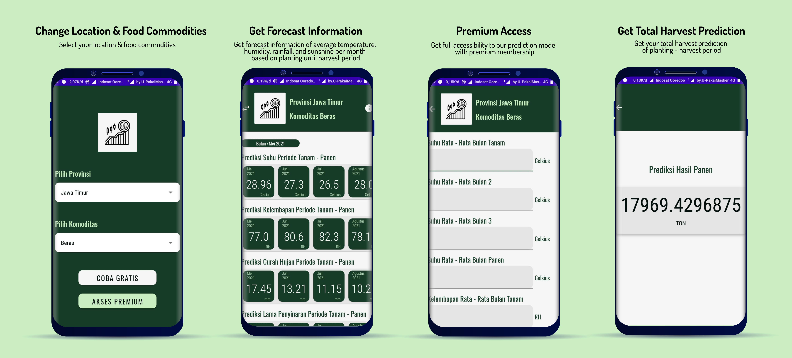
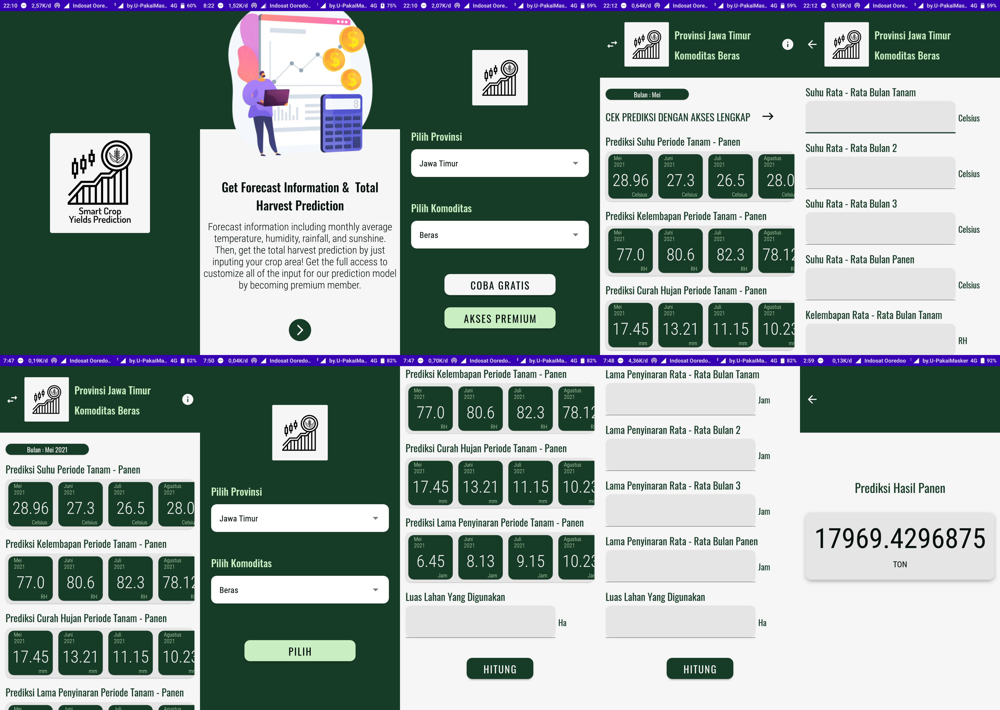

# Smart Crop Yiels Prediction Apps
Build with MVVM Architecture, Retrofit

### App Features
* **Change Location & Food Commodities** - Select your location & food commodities
* **Get Forecast Information** - Get forecast information of average temperature, humidity, rainfall, and sunshine per month based on planting until harvest period
* **Premium Access** - Get full accessibility to our prediction model with premium membership
* **Get Total Harvest Prediction** - Get your total harvest prediction of planting - harvest period

### Screenshot
<span align="center">
 <hr>
 <p align="center"></p>
 <p align="center">Mockup</p>
 <p align="center"></p>
 <p align="center">Screenshot</p>
 <hr>
</span>

### API
Base URL used on this project :
```
https://backend-rc-nchlkb6oxa-et.a.run.app/api
```

#### Endpoint Used

|Method | Endpoint | Usage |
| ---- | ---- | --------------- |
|GET| `/hum_predict` | Humidity Forecast |
|GET| `/temp_predict` | Temperature Forecast | 
|GET| `/rain_predict` | Rainfall Forecast | 
|GET| `/shine_predict` | Sunshine Forecast | 
|GET| `/crops_predict` | Total Harvest Prediction | 
